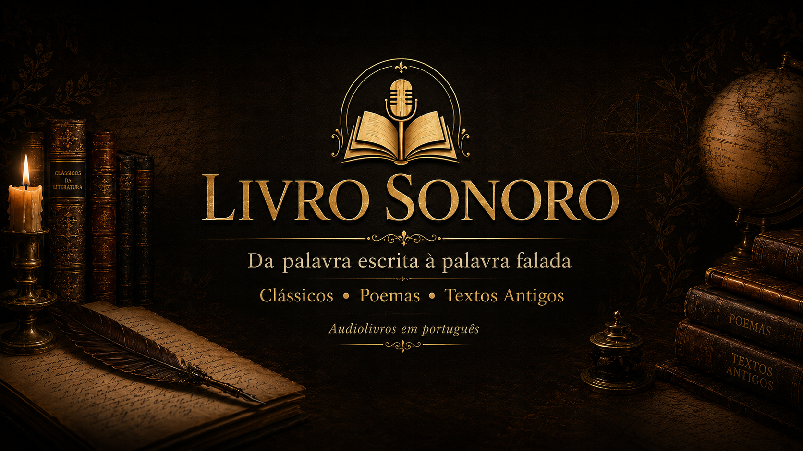

# Código completo — Biblioteca Virtual Livro Sonoro v1.3


## index.html

```html
<!doctype html>
<html lang="pt-BR">
<head>
  <meta charset="utf-8">
  <meta name="viewport" content="width=device-width, initial-scale=1">
  <title>Livro Sonoro — Biblioteca Virtual</title>
  <meta name="description" content="Biblioteca Virtual Livro Sonoro: audiolivros clássicos, poemas, textos antigos, literatura russa, Machado de Assis e obras autorais em português.">
  <meta property="og:title" content="Livro Sonoro — Biblioteca Virtual">
  <meta property="og:description" content="Da palavra escrita à palavra falada: clássicos, poemas e textos antigos para atravessar o tempo.">
  <meta property="og:type" content="website">
  <link rel="preconnect" href="https://fonts.googleapis.com">
  <link rel="preconnect" href="https://fonts.gstatic.com" crossorigin>
  <link href="https://fonts.googleapis.com/css2?family=Cormorant+Garamond:wght@600;700&family=Inter:wght@400;600;700;800&display=swap" rel="stylesheet">
  <link rel="stylesheet" href="style.css">
</head>
<body>
  <header class="topbar">
    <div class="container nav">
      <a class="brand" href="#">
        <span class="brand-mark">LS</span>
        <span>Livro Sonoro</span>
      </a>
      <nav class="nav-links" aria-label="Navegação principal">
        <a href="#inicio">Início</a>
        <a href="#catalogo">Audiobooks</a>
        <a href="#ebooks">eBooks/PDFs</a>
        <a href="#loja">Loja</a>
        <a href="#colecionaveis">Colecionáveis</a>
        <a href="#apoie">Apoie</a>
        <a href="#quem-somos">Contato</a>
      </nav>
    </div>
  </header>

  <main>
    <section id="inicio" class="hero">
      <div class="container hero-grid">
        <div>
          <p class="kicker">Biblioteca Virtual 1.0</p>
          <h1>Livro<br>Sonoro</h1>
          <p class="lead">
            Uma biblioteca brasileira independente de audiolivros em português.
            Clássicos, poemas, textos antigos e obras autorais para atravessar o tempo pela voz.
          </p>
          <div class="hero-actions">
            <a class="btn primary" href="#catalogo">Explorar biblioteca</a>
            <a class="btn" href="https://www.youtube.com/@livrosonoropodcast" target="_blank" rel="noopener">YouTube</a>
            <a class="btn" href="https://open.spotify.com/" target="_blank" rel="noopener">Spotify</a>
          </div>
          <div class="stats" aria-label="Resumo do projeto">
            <div class="stat"><strong>18</strong><span>obras iniciais</span></div>
            <div class="stat"><strong>7</strong><span>coleções editoriais</span></div>
            <div class="stat"><strong>100%</strong><span>curadoria independente</span></div>
          </div>
        </div>
        <div class="hero-card" aria-label="Imagem da Biblioteca Livro Sonoro">
          
        </div>
      </div>
    </section>


    <section class="section">
      <div class="container">
        <div class="library-hall">
          <div class="hall-content">
            <div>
              <p class="kicker">Corredor da biblioteca</p>
              <h2>Uma estante sonora e digital</h2>
              <p>O Livro Sonoro reúne audiobooks, e-books, PDFs, textos de apoio, obras autorais, pesquisa literária e futuros colecionáveis em uma experiência única de biblioteca.</p>
            </div>
            <div class="hall-labels">
              <span>Audiobooks</span>
              <span>eBooks</span>
              <span>PDFs</span>
              <span>Pesquisa</span>
              <span>Poesia</span>
              <span>Contos</span>
              <span>Loja</span>
              <span>Colecionáveis</span>
            </div>
          </div>
        </div>
      </div>
    </section>


    <section class="section">
      <div class="container">
        <div class="onepage-map">
          <div>
            <p class="kicker">Site One Page</p>
            <h2>Uma única página, várias prateleiras</h2>
            <p>O site foi organizado como uma biblioteca vertical: a pessoa entra, entende o projeto, explora audiobooks, encontra eBooks/PDFs, vê a loja, conhece os colecionáveis e chega às formas de apoio sem se perder.</p>
          </div>
          <div class="map-grid">
            <a href="#catalogo"><span>01</span>Audiobooks</a>
            <a href="#ebooks"><span>02</span>eBooks/PDFs</a>
            <a href="#pesquisa"><span>03</span>Pesquisa</a>
            <a href="#loja"><span>04</span>Loja</a>
            <a href="#colecionaveis"><span>05</span>Colecionáveis</a>
            <a href="#apoie"><span>06</span>Apoio</a>
          </div>
        </div>
      </div>
    </section>


    <section class="section">
      <div class="container">
        <div class="section-head">
          <div>
            <p class="kicker">Portais da biblioteca</p>
            <h2>O que você encontra aqui</h2>
          </div>
          <p>Quatro entradas principais para manter a página rica, mas ordenada.</p>
        </div>
        <div class="portal-grid">
          <a class="portal-card" href="#catalogo">
            <span>🎧</span>
            <h3>Audiobooks</h3>
            <p>Clássicos, textos antigos, literatura russa, brasileira, gótica e obras autorais.</p>
          </a>
          <a class="portal-card" href="#ebooks">
            <span>📚</span>
            <h3>eBooks e PDFs</h3>
            <p>Domínio público, materiais de leitura e arquivos úteis para estudantes.</p>
          </a>
          <a class="portal-card" href="#loja">
            <span>🛒</span>
            <h3>Loja literária</h3>
            <p>eBooks próprios, livros físicos, afiliados, parceiros e futuras edições especiais.</p>
          </a>
          <a class="portal-card" href="#colecionaveis">
            <span>🏺</span>
            <h3>Colecionáveis</h3>
            <p>Miniaturas, esculturas, marcadores com QR Code e caixas literárias.</p>
          </a>
        </div>
      </div>
    </section>

    <section id="destaques" class="section">
      <div class="container">
        <div class="section-head">
          <div>
            <p class="kicker">Primeira prateleira</p>
            <h2>Mais importantes agora</h2>
          </div>
          <p>As obras que melhor representam o começo da Biblioteca Virtual Livro Sonoro.</p>
        </div>
        <div id="destaques-grid" class="feature-grid"></div>
      </div>
    </section>

    <section id="catalogo" class="section">
      <div class="container">
        <div class="section-head">
          <div>
            <p class="kicker">Catálogo</p>
            <h2>Biblioteca completa</h2>
          </div>
          <p id="total-obras">18 obras</p>
        </div>

        <div class="tools">
          <input id="busca" class="search" type="search" placeholder="Buscar por obra, autor ou categoria...">
        </div>
        <div id="filtros" class="filters" aria-label="Filtros por categoria"></div>

        <div id="catalogo-grid" class="grid compact"></div>
      </div>
    </section>

    <section id="colecoes" class="section">
      <div class="container">
        <div class="section-head">
          <div>
            <p class="kicker">Organização editorial</p>
            <h2>Coleções</h2>
          </div>
          <p>A biblioteca foi pensada como prateleiras de escuta, não como lista solta de vídeos.</p>
        </div>

        <div class="collections">
          <div class="collection"><strong>Literatura</strong><p>Romances, novelas, clássicos universais e obras de formação.</p></div>
          <div class="collection"><strong>Contos</strong><p>Machado, Poe, narrativas curtas e textos perfeitos para escuta rápida.</p></div>
          <div class="collection"><strong>Poesia</strong><p>Poemas clássicos, leitura em voz alta e peças para escuta contemplativa.</p></div>
          <div class="collection"><strong>Apócrifos</strong><p>Textos antigos, livros proibidos, anjos caídos e tradições espirituais.</p></div>
          <div class="collection"><strong>Russos</strong><p>Dostoiévski, Tolstói e os grandes dramas da alma humana.</p></div>
          <div class="collection"><strong>Brasil</strong><p>Machado de Assis, Euclides da Cunha e literatura brasileira em voz alta.</p></div>
          <div class="collection"><strong>Gótico</strong><p>Drácula, Kafka, sombras, metamorfoses e horror literário.</p></div>
          <div class="collection"><strong>Filosofia</strong><p>Poder, estratégia, sabedoria e clássicos para pensar.</p></div>
          <div class="collection"><strong>Para dormir</strong><p>Obras calmas, profundas e belas para ouvir à noite.</p></div>
          <div class="collection"><strong>Autorais</strong><p>Obras de E. S. Almeida e o universo próprio do Livro Sonoro.</p></div>
          <div class="collection"><strong>Voz humana</strong><p>Curadoria, narração e edição com identidade brasileira independente.</p></div>
          <div class="collection"><strong>Ficção Científica</strong><p>Wells, distopias, futuros possíveis e imaginação especulativa.</p></div>
          <div class="collection"><strong>Infantil/Juvenil</strong><p>Obras de iniciação literária, fantasia, fábulas e escuta familiar.</p></div>
          <div class="collection"><strong>Autoajuda</strong><p>Conteúdos de desenvolvimento pessoal com cuidado autoral e curadoria segura.</p></div>
          <div class="collection"><strong>Humanidade</strong><p>Textos sobre dor, fé, sociedade, morte, esperança e condição humana.</p></div>
        </div>
      </div>
    </section>


    <section id="ebooks" class="section">
      <div class="container">
        <div class="section-head">
          <div>
            <p class="kicker">Leitura livre</p>
            <h2>eBooks, PDFs e domínio público</h2>
          </div>
          <p>Espaço para estudantes, leitores e pesquisadores acessarem textos, PDFs e materiais de apoio.</p>
        </div>
        <div id="ebooks-livres-grid" class="resource-grid"></div>
      </div>
    </section>

    <section id="pesquisa" class="section">
      <div class="container">
        <div class="section-head">
          <div>
            <p class="kicker">Pesquisa e estudo</p>
            <h2>Textos de apoio</h2>
          </div>
          <p>Uma área futura para guias, ensaios, contexto histórico, bibliografias e material acadêmico.</p>
        </div>
        <div id="pesquisa-grid" class="resource-grid"></div>
      </div>
    </section>

    <section id="loja" class="section">
      <div class="container">
        <div class="section-head">
          <div>
            <p class="kicker">Loja literária</p>
            <h2>eBooks à venda e parceiros</h2>
          </div>
          <p>Espaço para livros de E. S. Almeida, e-books próprios, livros físicos, links de afiliado e parcerias editoriais.</p>
        </div>
        <div id="ebooks-loja-grid" class="resource-grid"></div>
      </div>
    </section>

    <section id="colecionaveis" class="section">
      <div class="container">
        <div class="section-head">
          <div>
            <p class="kicker">Objetos literários</p>
            <h2>Colecionáveis e miniaturas</h2>
          </div>
          <p>Espaço para exibir esculturas, peças autorais, caixas literárias e edições especiais do universo Livro Sonoro.</p>
        </div>
        <div id="colecionaveis-grid" class="resource-grid"></div>
      </div>
    </section>


    <section id="monetizacao" class="section">
      <div class="container">
        <div class="section-head">
          <div>
            <p class="kicker">Sustentabilidade</p>
            <h2>Como a biblioteca pode se manter</h2>
          </div>
          <p>Primeiro com apoio direto e produtos próprios; depois com assinaturas, parceiros e anúncios controlados.</p>
        </div>

        <div class="monetization-grid">
          <div class="money-card">
            <strong>Agora</strong>
            <h3>Apoio direto</h3>
            <p>Pix, Apoia.se, membros do YouTube, venda de eBooks e links para livros próprios.</p>
          </div>
          <div class="money-card">
            <strong>Próxima fase</strong>
            <h3>Assinatura</h3>
            <p>Clube de ouvintes com episódios antecipados, PDFs de apoio, bastidores e votação das próximas obras.</p>
          </div>
          <div class="money-card">
            <strong>Parcerias</strong>
            <h3>Afiliados e editoras</h3>
            <p>Indicação de edições físicas, eBooks autorizados, livrarias, cursos, clubes de leitura e escolas.</p>
          </div>
          <div class="money-card">
            <strong>Com tráfego</strong>
            <h3>Anúncios com cuidado</h3>
            <p>Espaços discretos de patrocínio cultural, sem destruir o visual premium da biblioteca.</p>
          </div>
        </div>
      </div>
    </section>

    <section id="quem-somos" class="section">
      <div class="container">
        <div class="section-head">
          <div>
            <p class="kicker">Institucional</p>
            <h2>Quem somos</h2>
          </div>
          <p>Uma biblioteca independente em construção, criada por Everton S. Almeida.</p>
        </div>

        <div class="about-grid">
          <div class="about-box">
            <h3>Livro Sonoro</h3>
            <p>O Livro Sonoro é um projeto brasileiro independente de literatura em áudio. A proposta é transformar clássicos, poemas, textos antigos e obras autorais em experiências de escuta acessíveis, bonitas e organizadas.</p>
            <p>Da palavra escrita à palavra falada: clássicos, poemas e textos antigos para atravessar o tempo.</p>
          </div>
          <div class="about-box">
            <h3>Contato</h3>
            <p><strong>E-mail/Pix:</strong> canallivrosonoro@gmail.com</p>
            <p><strong>YouTube:</strong> @livrosonoropodcast</p>
            <p><strong>Instagram:</strong> @livro.sonoro</p>
            <p><strong>Autor:</strong> E. S. Almeida / Everton S. Almeida</p>
          </div>
        </div>
      </div>
    </section>

    <section id="apoie" class="section">
      <div class="container">
        <div class="cta">
          <div>
            <p class="kicker">Apoio independente</p>
            <h2>Apoie a biblioteca</h2>
            <p>
              O Livro Sonoro é um projeto brasileiro independente. Sua contribuição ajuda a manter novas leituras,
              capas, edições, publicações, legendas e a construção desta Biblioteca Virtual.
            </p>
            <div class="hero-actions">
              <a class="btn primary" href="#">Apoiar via Pix</a>
              <a class="btn" href="https://www.youtube.com/@livrosonoropodcast" target="_blank" rel="noopener">Inscrever-se</a>
            </div>
          </div>
          <div class="pix">Pix: canallivrosonoro@gmail.com</div>
        </div>
      </div>
    </section>

    <section class="section">
      <div class="container">
        <div class="section-head">
          <div>
            <p class="kicker">Sustentação do projeto</p>
            <h2>Formas de apoio</h2>
          </div>
          <p>Além do Pix, a Biblioteca pode apontar para assinaturas, livros, links de afiliado e futuras parcerias culturais.</p>
        </div>

        <div class="support-grid">
          <div class="support-card">
            <h3>Pix</h3>
            <p>Apoio direto para manter capas, edições, narrações e publicações do Livro Sonoro.</p>
            <button data-copy="canallivrosonoro@gmail.com">Copiar Pix</button>
          </div>
          <div class="support-card">
            <h3>Apoia.se</h3>
            <p>Use este espaço para um clube mensal: episódios antecipados, bastidores e votação de próximas obras.</p>
            <a href="#" aria-label="Apoiar no Apoia.se">Em breve</a>
          </div>
          <div class="support-card">
            <h3>Livros</h3>
            <p>Vitrine para obras de E. S. Almeida, como O Diabo Justo e outros projetos autorais.</p>
            <a href="#" aria-label="Ver livros do autor">Ver livros</a>
          </div>
          <div class="support-card">
            <h3>Parceiros</h3>
            <p>Espaço futuro para editoras, livrarias, escolas, clubes de leitura e marcas culturais.</p>
            <a href="mailto:canallivrosonoro@gmail.com">Contato</a>
          </div>
        </div>

        <div class="partner-strip">
          <p class="notice"><strong>Espaço para parceiros culturais:</strong> este bloco pode virar uma área de anúncios próprios, recomendações de livros, links de afiliado ou patrocínio direto. Para começar, é melhor usar apoios e parcerias manuais antes de depender de anúncios automáticos.</p>
        </div>
      </div>
    </section>


    <section id="contato" class="section">
      <div class="container">
        <div class="contact-panel">
          <div>
            <p class="kicker">Contato final</p>
            <h2>Entre em contato ou apoie o projeto</h2>
            <p>Use este espaço para receber propostas, parcerias, sugestões de obras, contatos de escolas, editoras, leitores e ouvintes.</p>
          </div>
          <div class="contact-actions">
            <a class="btn primary" href="mailto:canallivrosonoro@gmail.com">Enviar e-mail</a>
            <button class="btn" data-copy="canallivrosonoro@gmail.com">Copiar Pix</button>
            <a class="btn" href="https://www.youtube.com/@livrosonoropodcast" target="_blank" rel="noopener">YouTube</a>
          </div>
        </div>
      </div>
    </section>

  </main>

  <footer class="footer">
    <div class="container footer-grid">
      <p>© Livro Sonoro — Biblioteca Virtual 1.0</p>
      <div class="footer-links"><a href="#ebooks">eBooks/PDFs</a><a href="#loja">Loja</a><a href="#colecionaveis">Colecionáveis</a><a href="#quem-somos">Quem somos</a></div>
    </div>
  </footer>

  <script src="script.js"></script>
</body>
</html>

```


## style.css

```css

:root {
  --bg: #070605;
  --bg-2: #120d0a;
  --card: rgba(24, 17, 12, 0.76);
  --card-2: rgba(42, 29, 19, 0.78);
  --gold: #d6af63;
  --gold-2: #f3d994;
  --cream: #f5ead4;
  --muted: #b7a98e;
  --line: rgba(214, 175, 99, .22);
  --shadow: 0 24px 80px rgba(0, 0, 0, .5);
  --radius: 24px;
}

* { box-sizing: border-box; }

html { scroll-behavior: smooth; }

body {
  margin: 0;
  font-family: Inter, ui-sans-serif, system-ui, -apple-system, BlinkMacSystemFont, "Segoe UI", sans-serif;
  color: var(--cream);
  background:
    radial-gradient(circle at top left, rgba(154, 91, 34, .28), transparent 32rem),
    radial-gradient(circle at top right, rgba(214, 175, 99, .13), transparent 30rem),
    linear-gradient(180deg, #060504 0%, #100b08 45%, #050403 100%);
  min-height: 100vh;
}

body::before {
  content: "";
  position: fixed;
  inset: 0;
  pointer-events: none;
  background-image:
    linear-gradient(rgba(255,255,255,.018) 1px, transparent 1px),
    linear-gradient(90deg, rgba(255,255,255,.014) 1px, transparent 1px);
  background-size: 34px 34px;
  mask-image: linear-gradient(to bottom, rgba(0,0,0,.7), transparent 80%);
}

a { color: inherit; text-decoration: none; }

.container {
  width: min(1180px, calc(100% - 32px));
  margin: 0 auto;
}

.topbar {
  position: sticky;
  top: 0;
  z-index: 10;
  backdrop-filter: blur(18px);
  background: rgba(7, 6, 5, .74);
  border-bottom: 1px solid var(--line);
}

.nav {
  min-height: 74px;
  display: flex;
  justify-content: space-between;
  align-items: center;
  gap: 18px;
}

.brand {
  display: flex;
  align-items: center;
  gap: 13px;
  font-weight: 800;
  letter-spacing: .08em;
  text-transform: uppercase;
}

.brand-mark {
  width: 42px;
  height: 42px;
  border: 1px solid var(--line);
  border-radius: 50%;
  display: grid;
  place-items: center;
  color: var(--gold-2);
  background: radial-gradient(circle, rgba(214,175,99,.24), rgba(0,0,0,.4));
  box-shadow: 0 0 32px rgba(214, 175, 99, .12);
}

.nav-links {
  display: flex;
  gap: 14px;
  align-items: center;
  color: var(--muted);
  font-size: .93rem;
}

.nav-links a:hover { color: var(--gold-2); }

.hero {
  position: relative;
  padding: 86px 0 58px;
  overflow: hidden;
}

.hero-grid {
  display: grid;
  grid-template-columns: 1.05fr .95fr;
  gap: 44px;
  align-items: center;
}

.kicker {
  color: var(--gold-2);
  text-transform: uppercase;
  letter-spacing: .18em;
  font-weight: 800;
  font-size: .78rem;
}

h1 {
  font-family: "Cormorant Garamond", Georgia, serif;
  font-weight: 700;
  font-size: clamp(3.1rem, 8vw, 7rem);
  line-height: .86;
  margin: 16px 0 22px;
  letter-spacing: -.04em;
}

.lead {
  color: #d6c7a8;
  font-size: clamp(1.05rem, 2vw, 1.28rem);
  line-height: 1.65;
  max-width: 680px;
}

.hero-actions {
  display: flex;
  gap: 12px;
  flex-wrap: wrap;
  margin-top: 30px;
}

.btn {
  border: 1px solid var(--line);
  padding: 13px 18px;
  border-radius: 999px;
  background: rgba(255,255,255,.05);
  color: var(--cream);
  font-weight: 700;
  transition: transform .2s ease, border-color .2s ease, background .2s ease;
}

.btn.primary {
  background: linear-gradient(135deg, #b47a2d, #f0d086);
  color: #1b1008;
  border: none;
}

.btn:hover { transform: translateY(-2px); border-color: rgba(214,175,99,.5); }

.hero-card {
  position: relative;
  border: 1px solid var(--line);
  background: linear-gradient(145deg, rgba(255,255,255,.08), rgba(255,255,255,.02));
  border-radius: 34px;
  box-shadow: var(--shadow);
  overflow: hidden;
  min-height: 450px;
}

.hero-card img {
  width: 100%;
  height: 100%;
  min-height: 450px;
  object-fit: cover;
  opacity: .86;
  filter: contrast(1.05) saturate(.9);
}

.hero-card::after {
  content: "Clássicos • Poemas • Textos Antigos";
  position: absolute;
  left: 24px;
  right: 24px;
  bottom: 24px;
  padding: 16px 18px;
  border: 1px solid rgba(214,175,99,.3);
  border-radius: 18px;
  background: rgba(7,6,5,.72);
  backdrop-filter: blur(10px);
  color: var(--gold-2);
  font-family: "Cormorant Garamond", Georgia, serif;
  font-size: 1.45rem;
  text-align: center;
}

.stats {
  display: grid;
  grid-template-columns: repeat(3, 1fr);
  gap: 14px;
  margin-top: 32px;
}

.stat {
  border: 1px solid var(--line);
  background: rgba(255,255,255,.035);
  padding: 18px;
  border-radius: 18px;
}

.stat strong {
  display: block;
  font-size: 1.45rem;
  color: var(--gold-2);
}

.stat span { color: var(--muted); font-size: .92rem; }

.section {
  padding: 42px 0;
}

.section-head {
  display: flex;
  justify-content: space-between;
  align-items: end;
  gap: 20px;
  margin-bottom: 22px;
}

.section h2 {
  font-family: "Cormorant Garamond", Georgia, serif;
  font-size: clamp(2.1rem, 5vw, 4rem);
  line-height: .95;
  margin: 0;
}

.section p {
  color: var(--muted);
  line-height: 1.55;
}

.tools {
  display: flex;
  gap: 12px;
  flex-wrap: wrap;
  margin: 22px 0 28px;
}

.search {
  flex: 1 1 260px;
  min-width: 220px;
  border: 1px solid var(--line);
  border-radius: 999px;
  padding: 14px 18px;
  background: rgba(255,255,255,.05);
  color: var(--cream);
  outline: none;
}

.search::placeholder { color: rgba(245,234,212,.52); }

.filters {
  display: flex;
  gap: 10px;
  flex-wrap: wrap;
}

.filter {
  border: 1px solid var(--line);
  background: rgba(255,255,255,.04);
  color: var(--muted);
  padding: 12px 14px;
  border-radius: 999px;
  cursor: pointer;
  font-weight: 700;
}

.filter.active, .filter:hover {
  color: #1b1008;
  background: linear-gradient(135deg, #b47a2d, #f0d086);
  border-color: transparent;
}

.grid {
  display: grid;
  grid-template-columns: repeat(4, minmax(0, 1fr));
  gap: 18px;
}

.feature-grid {
  display: grid;
  grid-template-columns: repeat(3, minmax(0, 1fr));
  gap: 18px;
}

.card {
  position: relative;
  border: 1px solid var(--line);
  border-radius: var(--radius);
  overflow: hidden;
  background: linear-gradient(180deg, var(--card), rgba(10,8,6,.84));
  box-shadow: 0 18px 50px rgba(0,0,0,.28);
  transition: transform .22s ease, border-color .22s ease, box-shadow .22s ease;
}

.card:hover {
  transform: translateY(-4px);
  border-color: rgba(214,175,99,.46);
  box-shadow: 0 26px 70px rgba(0,0,0,.45);
}

.cover-wrap {
  position: relative;
  aspect-ratio: 1 / 1;
  overflow: hidden;
  background: #111;
}

.cover-wrap img {
  width: 100%;
  height: 100%;
  object-fit: cover;
  transition: scale .3s ease;
}

.card:hover .cover-wrap img { scale: 1.035; }

.duration {
  position: absolute;
  right: 12px;
  bottom: 12px;
  border: 1px solid rgba(214,175,99,.35);
  border-radius: 999px;
  padding: 7px 10px;
  background: rgba(0,0,0,.62);
  color: var(--gold-2);
  font-size: .78rem;
  font-weight: 800;
}

.card-body {
  padding: 16px;
}

.category {
  margin: 0 0 8px;
  color: var(--gold-2) !important;
  text-transform: uppercase;
  letter-spacing: .11em;
  font-weight: 800;
  font-size: .7rem;
}

.card h3 {
  margin: 0;
  font-family: "Cormorant Garamond", Georgia, serif;
  font-size: 1.65rem;
  line-height: .95;
}

.author {
  margin: 8px 0 0;
  color: #dbcda9 !important;
  font-size: .92rem;
}

.promise {
  min-height: 48px;
  margin: 12px 0;
  font-size: .95rem;
}

.badges {
  display: flex;
  gap: 7px;
  flex-wrap: wrap;
  margin: 12px 0 14px;
}

.badges span {
  border: 1px solid rgba(214,175,99,.23);
  color: #e9d8ac;
  background: rgba(214,175,99,.07);
  padding: 6px 8px;
  border-radius: 999px;
  font-size: .72rem;
  font-weight: 700;
}

.actions {
  display: grid;
  grid-template-columns: 1fr 1fr;
  gap: 8px;
}

.actions a {
  text-align: center;
  border-radius: 999px;
  padding: 10px 8px;
  border: 1px solid var(--line);
  font-weight: 800;
  font-size: .84rem;
}

.actions a:first-child {
  background: rgba(30, 215, 96, .12);
}

.actions a:hover {
  background: rgba(214,175,99,.16);
}

.collections {
  display: grid;
  grid-template-columns: repeat(4, 1fr);
  gap: 16px;
  margin-top: 16px;
}

.collection {
  min-height: 150px;
  border: 1px solid var(--line);
  border-radius: 24px;
  padding: 20px;
  background:
    linear-gradient(135deg, rgba(214,175,99,.14), rgba(0,0,0,.18)),
    rgba(255,255,255,.035);
}

.collection strong {
  display: block;
  color: var(--gold-2);
  font-family: "Cormorant Garamond", Georgia, serif;
  font-size: 1.7rem;
  line-height: 1;
  margin-bottom: 10px;
}

.cta {
  margin: 56px 0;
  border: 1px solid var(--line);
  border-radius: 32px;
  padding: 34px;
  background:
    radial-gradient(circle at right, rgba(214,175,99,.2), transparent 24rem),
    rgba(255,255,255,.035);
  display: grid;
  grid-template-columns: 1.2fr .8fr;
  gap: 22px;
  align-items: center;
}

.pix {
  border: 1px solid var(--line);
  border-radius: 18px;
  padding: 18px;
  background: rgba(0,0,0,.26);
  color: var(--gold-2);
  font-weight: 900;
  text-align: center;
  word-break: break-word;
}

.footer {
  padding: 36px 0 54px;
  border-top: 1px solid var(--line);
  color: var(--muted);
}

.footer-grid {
  display: flex;
  justify-content: space-between;
  gap: 22px;
  flex-wrap: wrap;
}

@media (max-width: 980px) {
  .hero-grid, .cta { grid-template-columns: 1fr; }
  .grid { grid-template-columns: repeat(3, minmax(0, 1fr)); }
  .feature-grid { grid-template-columns: repeat(2, minmax(0, 1fr)); }
  .collections { grid-template-columns: repeat(2, 1fr); }
  .hero-card { min-height: 340px; }
  .hero-card img { min-height: 340px; }
}

@media (max-width: 680px) {
  .container { width: min(100% - 24px, 1180px); }
  .nav { align-items: flex-start; flex-direction: column; padding: 14px 0; }
  .nav-links { width: 100%; overflow-x: auto; padding-bottom: 6px; }
  .hero { padding-top: 50px; }
  .grid, .feature-grid { grid-template-columns: repeat(2, minmax(0, 1fr)); gap: 12px; }
  .card-body { padding: 12px; }
  .card h3 { font-size: 1.28rem; }
  .promise { display: none; }
  .badges span { font-size: .64rem; }
  .actions { grid-template-columns: 1fr; }
  .collections { grid-template-columns: 1fr; }
  .stats { grid-template-columns: 1fr; }
  .section-head { align-items: flex-start; flex-direction: column; }
}

@media (max-width: 420px) {
  .grid, .feature-grid { grid-template-columns: 1fr; }
  h1 { font-size: 3.25rem; }
}


/* Versão 1.1 — blocos de apoio, parceiros e manutenção */
.support-grid {
  display: grid;
  grid-template-columns: repeat(4, 1fr);
  gap: 16px;
  margin-top: 20px;
}

.support-card {
  border: 1px solid var(--line);
  border-radius: 24px;
  padding: 20px;
  background: linear-gradient(180deg, rgba(255,255,255,.055), rgba(255,255,255,.025));
  min-height: 180px;
}

.support-card h3 {
  margin: 0 0 10px;
  color: var(--gold-2);
  font-family: "Cormorant Garamond", Georgia, serif;
  font-size: 1.8rem;
  line-height: .95;
}

.support-card p { font-size: .95rem; }

.support-card button,
.support-card a {
  display: inline-flex;
  align-items: center;
  justify-content: center;
  margin-top: 10px;
  min-height: 42px;
  border-radius: 999px;
  border: 1px solid var(--line);
  padding: 10px 14px;
  color: var(--cream);
  background: rgba(0,0,0,.24);
  font-weight: 800;
  cursor: pointer;
}

.support-card button:hover,
.support-card a:hover {
  border-color: rgba(214,175,99,.52);
  background: rgba(214,175,99,.12);
}

.partner-strip {
  border: 1px dashed rgba(214,175,99,.34);
  border-radius: 24px;
  padding: 22px;
  background: rgba(214,175,99,.055);
  margin-top: 20px;
}

.partner-strip strong { color: var(--gold-2); }

.notice {
  color: #dfcfaa;
  font-size: .92rem;
  line-height: 1.55;
}

@media (max-width: 980px) {
  .support-grid { grid-template-columns: repeat(2, 1fr); }
}

@media (max-width: 680px) {
  .support-grid { grid-template-columns: 1fr; }
}


/* Versão 1.2 — biblioteca expandida: audiobooks, e-books, PDFs, loja e colecionáveis */
.library-hall {
  position: relative;
  overflow: hidden;
  border: 1px solid var(--line);
  border-radius: 34px;
  padding: 28px;
  margin-top: 26px;
  background:
    linear-gradient(90deg, rgba(0,0,0,.72), rgba(0,0,0,.34)),
    repeating-linear-gradient(90deg, rgba(214,175,99,.08) 0 6px, transparent 6px 42px),
    radial-gradient(circle at center, rgba(214,175,99,.16), transparent 44rem);
}

.library-hall::before {
  content: "";
  position: absolute;
  inset: 0;
  pointer-events: none;
  background:
    linear-gradient(90deg, rgba(214,175,99,.10) 1px, transparent 1px),
    linear-gradient(180deg, rgba(214,175,99,.08) 1px, transparent 1px);
  background-size: 70px 90px;
  opacity: .35;
}

.hall-content {
  position: relative;
  z-index: 1;
  display: grid;
  grid-template-columns: 1fr auto;
  gap: 18px;
  align-items: center;
}

.hall-content h2 {
  margin-bottom: 10px;
}

.hall-labels {
  display: flex;
  flex-wrap: wrap;
  gap: 8px;
  justify-content: flex-end;
}

.hall-labels span {
  border: 1px solid rgba(214,175,99,.28);
  border-radius: 999px;
  padding: 8px 10px;
  background: rgba(0,0,0,.34);
  color: var(--gold-2);
  font-weight: 800;
  font-size: .78rem;
}

.grid.compact .card h3 {
  font-size: 1.42rem;
}

.grid.compact .promise {
  min-height: 38px;
  font-size: .87rem;
}

.grid.compact .card-body {
  padding: 13px;
}

.resource-grid {
  display: grid;
  grid-template-columns: repeat(3, 1fr);
  gap: 16px;
  margin-top: 18px;
}

.resource-card {
  display: flex;
  flex-direction: column;
  justify-content: space-between;
  min-height: 230px;
  border: 1px solid var(--line);
  border-radius: 24px;
  padding: 20px;
  background:
    radial-gradient(circle at top right, rgba(214,175,99,.13), transparent 16rem),
    rgba(255,255,255,.035);
}

.resource-card h3 {
  font-family: "Cormorant Garamond", Georgia, serif;
  font-size: 1.75rem;
  line-height: .95;
  margin: 0 0 8px;
}

.resource-card p {
  margin: 7px 0;
}

.resource-kicker {
  color: var(--gold-2) !important;
  text-transform: uppercase;
  letter-spacing: .13em;
  font-size: .72rem;
  font-weight: 900;
}

.resource-meta {
  display: flex;
  flex-wrap: wrap;
  gap: 8px;
  margin: 14px 0;
}

.resource-meta span {
  border: 1px solid rgba(214,175,99,.25);
  border-radius: 999px;
  padding: 7px 9px;
  color: #ecd9aa;
  background: rgba(214,175,99,.06);
  font-size: .76rem;
  font-weight: 800;
}

.resource-card a {
  align-self: flex-start;
  border: 1px solid var(--line);
  border-radius: 999px;
  padding: 10px 14px;
  font-weight: 900;
  background: rgba(0,0,0,.24);
}

.shop-card {
  background:
    radial-gradient(circle at top right, rgba(180,122,45,.20), transparent 18rem),
    linear-gradient(180deg, rgba(255,255,255,.055), rgba(255,255,255,.026));
}

.about-grid {
  display: grid;
  grid-template-columns: 1.1fr .9fr;
  gap: 18px;
  margin-top: 18px;
}

.about-box {
  border: 1px solid var(--line);
  border-radius: 26px;
  padding: 24px;
  background: rgba(255,255,255,.035);
}

.about-box h3 {
  color: var(--gold-2);
  margin: 0 0 10px;
  font-family: "Cormorant Garamond", Georgia, serif;
  font-size: 2rem;
}

.footer-links {
  display: flex;
  gap: 12px;
  flex-wrap: wrap;
}

.footer-links a {
  color: var(--gold-2);
}

@media (max-width: 980px) {
  .resource-grid { grid-template-columns: repeat(2, 1fr); }
  .hall-content { grid-template-columns: 1fr; }
  .hall-labels { justify-content: flex-start; }
  .about-grid { grid-template-columns: 1fr; }
}

@media (max-width: 680px) {
  .resource-grid { grid-template-columns: 1fr; }
}


/* Versão 1.3 — refinamento One Page: blocos, mapa, portais e monetização */
.onepage-map {
  border: 1px solid var(--line);
  border-radius: 32px;
  padding: 28px;
  background:
    radial-gradient(circle at top right, rgba(214,175,99,.18), transparent 24rem),
    rgba(255,255,255,.035);
  display: grid;
  grid-template-columns: 1fr 1.2fr;
  gap: 24px;
  align-items: center;
}

.onepage-map h2 { margin: 0 0 12px; }

.map-grid {
  display: grid;
  grid-template-columns: repeat(3, 1fr);
  gap: 11px;
}

.map-grid a {
  border: 1px solid var(--line);
  border-radius: 18px;
  padding: 14px;
  background: rgba(0,0,0,.22);
  color: var(--cream);
  font-weight: 900;
  transition: .2s ease;
}

.map-grid a:hover {
  transform: translateY(-2px);
  border-color: rgba(214,175,99,.55);
  background: rgba(214,175,99,.10);
}

.map-grid span {
  display: block;
  color: var(--gold-2);
  font-size: .74rem;
  letter-spacing: .16em;
  margin-bottom: 6px;
}

.portal-grid {
  display: grid;
  grid-template-columns: repeat(4, 1fr);
  gap: 16px;
}

.portal-card {
  border: 1px solid var(--line);
  border-radius: 26px;
  padding: 22px;
  min-height: 230px;
  background:
    linear-gradient(180deg, rgba(255,255,255,.055), rgba(255,255,255,.023)),
    rgba(0,0,0,.18);
  transition: .22s ease;
}

.portal-card:hover {
  transform: translateY(-4px);
  border-color: rgba(214,175,99,.52);
  box-shadow: 0 22px 60px rgba(0,0,0,.34);
}

.portal-card span {
  display: inline-grid;
  place-items: center;
  width: 48px;
  height: 48px;
  border: 1px solid var(--line);
  border-radius: 50%;
  margin-bottom: 16px;
  background: rgba(214,175,99,.08);
}

.portal-card h3,
.money-card h3 {
  margin: 0 0 10px;
  font-family: "Cormorant Garamond", Georgia, serif;
  font-size: 2rem;
  color: var(--gold-2);
  line-height: .95;
}

.monetization-grid {
  display: grid;
  grid-template-columns: repeat(4, 1fr);
  gap: 16px;
}

.money-card {
  border: 1px solid var(--line);
  border-radius: 24px;
  padding: 22px;
  background:
    radial-gradient(circle at top right, rgba(214,175,99,.15), transparent 18rem),
    rgba(255,255,255,.035);
  min-height: 220px;
}

.money-card strong {
  display: inline-flex;
  color: #1b1008;
  background: linear-gradient(135deg, #b47a2d, #f0d086);
  border-radius: 999px;
  padding: 7px 10px;
  font-size: .74rem;
  text-transform: uppercase;
  letter-spacing: .08em;
  margin-bottom: 16px;
}

.contact-panel {
  border: 1px solid var(--line);
  border-radius: 32px;
  padding: 30px;
  background:
    linear-gradient(135deg, rgba(214,175,99,.14), rgba(0,0,0,.22)),
    rgba(255,255,255,.035);
  display: grid;
  grid-template-columns: 1.1fr .9fr;
  gap: 20px;
  align-items: center;
}

.contact-actions {
  display: flex;
  gap: 12px;
  flex-wrap: wrap;
  justify-content: flex-end;
}

.contact-actions button { cursor: pointer; }

@media (max-width: 980px) {
  .onepage-map,
  .contact-panel { grid-template-columns: 1fr; }

  .portal-grid,
  .monetization-grid { grid-template-columns: repeat(2, 1fr); }

  .map-grid { grid-template-columns: repeat(2, 1fr); }

  .contact-actions { justify-content: flex-start; }
}

@media (max-width: 680px) {
  .portal-grid,
  .monetization-grid,
  .map-grid { grid-template-columns: 1fr; }
}

```


## script.js

```javascript
const catalogo = [
  {
    "id": "enoque",
    "titulo": "O Livro de Enoque",
    "autor": "Texto antigo",
    "categoria": "Apócrifos",
    "promessa": "Anjos caídos, gigantes e segredos antigos.",
    "duracao": "2h53",
    "selos": [
      "Texto antigo",
      "Voz humana",
      "Completo"
    ],
    "img": "assets/capas/enoque.png",
    "youtube": "#",
    "spotify": "#",
    "destaque": true
  },
  {
    "id": "judas",
    "titulo": "O Evangelho de Judas",
    "autor": "Texto apócrifo",
    "categoria": "Apócrifos",
    "promessa": "O livro proibido e a outra face da traição.",
    "duracao": "30min",
    "selos": [
      "Texto apócrifo",
      "Mistério",
      "Voz humana"
    ],
    "img": "assets/capas/judas.png",
    "youtube": "#",
    "spotify": "#",
    "destaque": true
  },
  {
    "id": "tome",
    "titulo": "O Evangelho de Tomé",
    "autor": "Texto apócrifo",
    "categoria": "Apócrifos",
    "promessa": "114 palavras secretas atribuídas a Jesus.",
    "duracao": "Especial",
    "selos": [
      "Texto apócrifo",
      "Voz humana",
      "Biblioteca"
    ],
    "img": "assets/capas/tome.png",
    "youtube": "#",
    "spotify": "#",
    "destaque": true
  },
  {
    "id": "crime-castigo",
    "titulo": "Crime e Castigo",
    "autor": "Fiódor Dostoiévski",
    "categoria": "Literatura Russa",
    "promessa": "Culpa, delírio e redenção em áudio.",
    "duracao": "Série",
    "selos": [
      "Drama russo",
      "Voz humana",
      "Série"
    ],
    "img": "assets/capas/crime-castigo.png",
    "youtube": "#",
    "spotify": "#",
    "destaque": true
  },
  {
    "id": "anna",
    "titulo": "Anna Karenina",
    "autor": "Liev Tolstói",
    "categoria": "Literatura Russa",
    "promessa": "Paixão, sociedade e destino na Rússia imperial.",
    "duracao": "Parte 1 · 5h20",
    "selos": [
      "Drama russo",
      "Voz humana",
      "Parte completa"
    ],
    "img": "assets/capas/anna.png",
    "youtube": "#",
    "spotify": "#",
    "destaque": true
  },
  {
    "id": "noites-brancas",
    "titulo": "Noites Brancas",
    "autor": "Fiódor Dostoiévski",
    "categoria": "Literatura Russa",
    "promessa": "Um amor quase possível em São Petersburgo.",
    "duracao": "2h19",
    "selos": [
      "Clássico",
      "Para dormir",
      "Voz humana"
    ],
    "img": "assets/capas/noites-brancas.png",
    "youtube": "#",
    "spotify": "#",
    "destaque": true
  },
  {
    "id": "ivan",
    "titulo": "A Morte de Ivan Ilitch",
    "autor": "Liev Tolstói",
    "categoria": "Clássicos",
    "promessa": "O clássico sobre o medo de morrer.",
    "duracao": "2h43",
    "selos": [
      "Clássico essencial",
      "Voz humana",
      "Completo"
    ],
    "img": "assets/capas/ivan.png",
    "youtube": "#",
    "spotify": "#",
    "destaque": false
  },
  {
    "id": "metamorfose",
    "titulo": "A Metamorfose",
    "autor": "Franz Kafka",
    "categoria": "Gótico e Horror",
    "promessa": "O pesadelo de acordar transformado.",
    "duracao": "2h11",
    "selos": [
      "Gótico",
      "Audiolivro",
      "Completo"
    ],
    "img": "assets/capas/metamorfose.png",
    "youtube": "#",
    "spotify": "#",
    "destaque": false
  },
  {
    "id": "dracula",
    "titulo": "Drácula",
    "autor": "Bram Stoker",
    "categoria": "Gótico e Horror",
    "promessa": "Castelo, sombras e terror gótico.",
    "duracao": "Série",
    "selos": [
      "Gótico",
      "Voz humana",
      "Série"
    ],
    "img": "assets/capas/dracula.png",
    "youtube": "#",
    "spotify": "#",
    "destaque": false
  },
  {
    "id": "inferno",
    "titulo": "Inferno",
    "autor": "Dante Alighieri",
    "categoria": "Clássicos",
    "promessa": "A jornada de Dante pelos 9 círculos.",
    "duracao": "6h34",
    "selos": [
      "Clássico",
      "Épico",
      "Completo"
    ],
    "img": "assets/capas/inferno.png",
    "youtube": "#",
    "spotify": "#",
    "destaque": false
  },
  {
    "id": "alienista",
    "titulo": "O Alienista",
    "autor": "Machado de Assis",
    "categoria": "Literatura Brasileira",
    "promessa": "Loucura, poder e ironia brasileira.",
    "duracao": "Especial",
    "selos": [
      "Machado",
      "Clássico brasileiro",
      "Voz humana"
    ],
    "img": "assets/capas/alienista.png",
    "youtube": "#",
    "spotify": "#",
    "destaque": false
  },
  {
    "id": "igreja-diabo",
    "titulo": "A Igreja do Diabo",
    "autor": "Machado de Assis",
    "categoria": "Literatura Brasileira",
    "promessa": "Sátira, tentação e hipocrisia humana.",
    "duracao": "22min",
    "selos": [
      "Machado",
      "Conto clássico",
      "Voz humana"
    ],
    "img": "assets/capas/igreja-diabo.png",
    "youtube": "#",
    "spotify": "#",
    "destaque": false
  },
  {
    "id": "sermao-diabo",
    "titulo": "O Sermão do Diabo",
    "autor": "Machado de Assis",
    "categoria": "Literatura Brasileira",
    "promessa": "A sátira mais ácida de Machado.",
    "duracao": "7min",
    "selos": [
      "Machado",
      "Conto curto",
      "Voz humana"
    ],
    "img": "assets/capas/sermao-diabo.png",
    "youtube": "#",
    "spotify": "#",
    "destaque": false
  },
  {
    "id": "sertoes",
    "titulo": "Os Sertões",
    "autor": "Euclides da Cunha",
    "categoria": "Literatura Brasileira",
    "promessa": "Canudos e o Brasil profundo.",
    "duracao": "3h35",
    "selos": [
      "Brasil",
      "Clássico",
      "Completo"
    ],
    "img": "assets/capas/sertoes.png",
    "youtube": "#",
    "spotify": "#",
    "destaque": false
  },
  {
    "id": "profeta",
    "titulo": "O Profeta",
    "autor": "Khalil Gibran",
    "categoria": "Espiritualidade",
    "promessa": "Sabedoria atemporal para ouvir com calma.",
    "duracao": "1h19",
    "selos": [
      "Espiritual",
      "Para dormir",
      "Completo"
    ],
    "img": "assets/capas/profeta.png",
    "youtube": "#",
    "spotify": "#",
    "destaque": false
  },
  {
    "id": "principe-maquiavel",
    "titulo": "O Príncipe",
    "autor": "Maquiavel",
    "categoria": "Filosofia e Poder",
    "promessa": "O manual clássico do poder.",
    "duracao": "4h03",
    "selos": [
      "Filosofia",
      "Poder",
      "Completo"
    ],
    "img": "assets/capas/principe-maquiavel.png",
    "youtube": "#",
    "spotify": "#",
    "destaque": false
  },
  {
    "id": "pequeno-principe",
    "titulo": "O Pequeno Príncipe",
    "autor": "Antoine de Saint-Exupéry",
    "categoria": "Clássicos",
    "promessa": "A obra que todo adulto deveria ouvir.",
    "duracao": "1h54",
    "selos": [
      "Clássico",
      "Para dormir",
      "Completo"
    ],
    "img": "assets/capas/pequeno-principe.png",
    "youtube": "#",
    "spotify": "#",
    "destaque": false
  },
  {
    "id": "diabo-justo",
    "titulo": "O Diabo Justo",
    "autor": "E. S. Almeida",
    "categoria": "Obras Autorais",
    "promessa": "O Evangelho dos Dragões Caídos.",
    "duracao": "Teaser",
    "selos": [
      "Autoral",
      "Fantasia sombria",
      "Voz humana"
    ],
    "img": "assets/capas/diabo-justo.png",
    "youtube": "#",
    "spotify": "#",
    "destaque": false
  }
];

const grid = document.querySelector("#catalogo-grid");
const destaqueGrid = document.querySelector("#destaques-grid");
const filtros = document.querySelector("#filtros");
const busca = document.querySelector("#busca");
const total = document.querySelector("#total-obras");

const categorias = ["Todos", ...Array.from(new Set(catalogo.map(item => item.categoria)))];

function criarFiltros() {
  filtros.innerHTML = categorias.map(cat => `
    <button class="filter ${cat === "Todos" ? "active" : ""}" data-cat="${cat}">
      ${cat}
    </button>
  `).join("");

  filtros.querySelectorAll("button").forEach(btn => {
    btn.addEventListener("click", () => {
      filtros.querySelectorAll("button").forEach(b => b.classList.remove("active"));
      btn.classList.add("active");
      renderizar();
    });
  });
}

function card(item, destaque = false) {
  const selos = item.selos.map(s => `<span>${s}</span>`).join("");
  return `
    <article class="card ${destaque ? "card-featured" : ""}">
      <div class="cover-wrap">
        
        <div class="duration">${item.duracao}</div>
      </div>
      <div class="card-body">
        <p class="category">${item.categoria}</p>
        <h3>${item.titulo}</h3>
        <p class="author">${item.autor}</p>
        <p class="promise">${item.promessa}</p>
        <div class="badges">${selos}</div>
        <div class="actions">
          <a href="${item.spotify}" aria-label="Ouvir ${item.titulo} no Spotify">Spotify</a>
          <a href="${item.youtube}" aria-label="Assistir ${item.titulo} no YouTube">YouTube</a>
        </div>
      </div>
    </article>
  `;
}

function renderizar() {
  const cat = filtros.querySelector(".active")?.dataset.cat || "Todos";
  const termo = busca.value.toLowerCase().trim();

  const filtrados = catalogo.filter(item => {
    const combinaCategoria = cat === "Todos" || item.categoria === cat;
    const texto = `${item.titulo} ${item.autor} ${item.categoria} ${item.promessa}`.toLowerCase();
    const combinaBusca = !termo || texto.includes(termo);
    return combinaCategoria && combinaBusca;
  });

  grid.innerHTML = filtrados.map(item => card(item)).join("");
  total.textContent = `${filtrados.length} obra${filtrados.length === 1 ? "" : "s"}`;
}

function renderizarDestaques() {
  const destaques = catalogo.filter(item => item.destaque).slice(0, 6);
  destaqueGrid.innerHTML = destaques.map(item => card(item, true)).join("");
}

criarFiltros();
renderizarDestaques();
renderizar();
busca.addEventListener("input", renderizar);


// Pequenas funções da versão 1.1
document.querySelectorAll("[data-copy]").forEach(btn => {
  btn.addEventListener("click", async () => {
    const texto = btn.dataset.copy;
    try {
      await navigator.clipboard.writeText(texto);
      const original = btn.textContent;
      btn.textContent = "Pix copiado!";
      setTimeout(() => btn.textContent = original, 1800);
    } catch (err) {
      alert("Pix: " + texto);
    }
  });
});

document.querySelectorAll("a[href='#']").forEach(link => {
  link.addEventListener("click", (event) => {
    const texto = link.textContent.trim().toLowerCase();
    if (texto.includes("spotify") || texto.includes("youtube")) {
      event.preventDefault();
      alert("Este botão ainda precisa receber o link real no arquivo script.js");
    }
  });
});


// Conteúdos complementares da versão 1.2
// Aqui entram e-books gratuitos, PDFs, textos acadêmicos e e-books pagos/afiliados.
// Troque os links "#" pelos links reais quando estiver pronto.

const ebooksLivres = [
  {
    titulo: "Dom Casmurro",
    autor: "Machado de Assis",
    categoria: "Literatura Brasileira",
    formato: "PDF / eBook",
    uso: "Domínio público",
    descricao: "Romance essencial para estudantes, leitores e vestibulandos.",
    link: "#"
  },
  {
    titulo: "O Alienista",
    autor: "Machado de Assis",
    categoria: "Contos e Novelas",
    formato: "PDF / eBook",
    uso: "Domínio público",
    descricao: "Sátira brasileira sobre ciência, poder e loucura.",
    link: "#"
  },
  {
    titulo: "Noites Brancas",
    autor: "Fiódor Dostoiévski",
    categoria: "Literatura Russa",
    formato: "PDF / eBook",
    uso: "Domínio público",
    descricao: "Uma leitura curta e intensa para estudo e escuta comparada.",
    link: "#"
  },
  {
    titulo: "A Metamorfose",
    autor: "Franz Kafka",
    categoria: "Ficção e Humanidade",
    formato: "PDF / eBook",
    uso: "Verificar edição/tradução",
    descricao: "Obra fundamental sobre alienação, família e desumanização.",
    link: "#"
  },
  {
    titulo: "A Máquina do Tempo",
    autor: "H. G. Wells",
    categoria: "Ficção Científica",
    formato: "PDF / eBook",
    uso: "Domínio público",
    descricao: "Clássico fundador da ficção científica moderna.",
    link: "#"
  },
  {
    titulo: "Poemas Selecionados",
    autor: "Autores clássicos",
    categoria: "Poesia",
    formato: "PDF",
    uso: "Curadoria Livro Sonoro",
    descricao: "Coletânea futura para leitura, estudo e audição.",
    link: "#"
  }
];

const ebooksLoja = [
  {
    titulo: "O Diabo Justo",
    autor: "E. S. Almeida",
    tipo: "eBook / Livro físico",
    descricao: "Fantasia sombria, mitologia, deuses em ruínas e dragões caídos.",
    preco: "Amazon / autoral",
    link: "#"
  },
  {
    titulo: "O Dragão que Riu da Tempestade",
    autor: "E. S. Almeida",
    tipo: "eBook / Impresso",
    descricao: "Romance poético afro-surrealista sobre dor, cidade e transformação.",
    preco: "Autor independente",
    link: "#"
  },
  {
    titulo: "Clássicos recomendados",
    autor: "Parceiros / afiliados",
    tipo: "Link afiliado",
    descricao: "Espaço para livros físicos, e-books e edições comentadas de parceiros.",
    preco: "Comissão futura",
    link: "#"
  }
];

const textosPesquisa = [
  {
    titulo: "Guias de leitura",
    area: "Estudantes",
    descricao: "Resumos, contexto histórico, personagens, temas e perguntas para estudo.",
    status: "Em construção"
  },
  {
    titulo: "Textos acadêmicos",
    area: "Pesquisa",
    descricao: "Espaço para ensaios, artigos, referências e materiais de apoio.",
    status: "Em construção"
  },
  {
    titulo: "Domínio público",
    area: "Direitos autorais",
    descricao: "Notas sobre quais obras são seguras, quais exigem cuidado e quais têm tradução protegida.",
    status: "Essencial"
  }
];

const colecionaveis = [
  {
    titulo: "Miniaturas literárias",
    descricao: "Exposição futura de esculturas, bustos, criaturas e peças inspiradas em obras autorais.",
    status: "Galeria"
  },
  {
    titulo: "Caixas literárias",
    descricao: "Livro físico + marcador com QR Code + trilha sonora + item colecionável.",
    status: "Produto futuro"
  },
  {
    titulo: "Marcadores com QR Code",
    descricao: "Peças simples para conectar livro físico, audiobook e página do projeto.",
    status: "Primeira produção"
  }
];

function renderizarListaSimples(containerId, lista, tipo) {
  const container = document.querySelector(containerId);
  if (!container) return;

  container.innerHTML = lista.map(item => {
    if (tipo === "ebook-livre") {
      return `
        <article class="resource-card">
          <div>
            <p class="resource-kicker">${item.categoria}</p>
            <h3>${item.titulo}</h3>
            <p>${item.autor}</p>
            <p>${item.descricao}</p>
          </div>
          <div class="resource-meta">
            <span>${item.formato}</span>
            <span>${item.uso}</span>
          </div>
          <a href="${item.link}">Acessar</a>
        </article>
      `;
    }

    if (tipo === "loja") {
      return `
        <article class="resource-card shop-card">
          <div>
            <p class="resource-kicker">${item.tipo}</p>
            <h3>${item.titulo}</h3>
            <p>${item.autor}</p>
            <p>${item.descricao}</p>
          </div>
          <div class="resource-meta">
            <span>${item.preco}</span>
          </div>
          <a href="${item.link}">Ver produto</a>
        </article>
      `;
    }

    return `
      <article class="resource-card">
        <div>
          <p class="resource-kicker">${item.area || item.status}</p>
          <h3>${item.titulo}</h3>
          <p>${item.descricao}</p>
        </div>
        <div class="resource-meta">
          <span>${item.status}</span>
        </div>
      </article>
    `;
  }).join("");
}

renderizarListaSimples("#ebooks-livres-grid", ebooksLivres, "ebook-livre");
renderizarListaSimples("#ebooks-loja-grid", ebooksLoja, "loja");
renderizarListaSimples("#pesquisa-grid", textosPesquisa, "pesquisa");
renderizarListaSimples("#colecionaveis-grid", colecionaveis, "colecionaveis");

```
